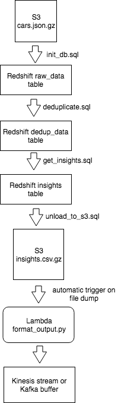
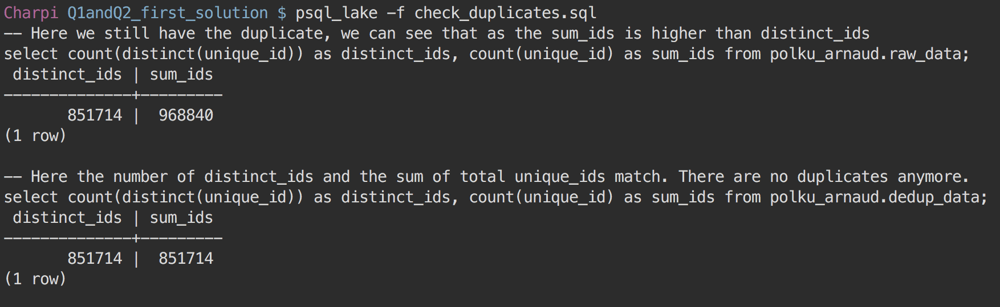
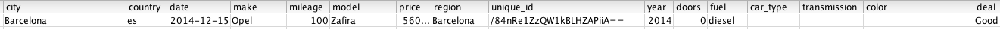

# Sort deals in cars classified ads

The solution implemented aims to assess the quality of the offers for each classified ads in regard to help the users making their mind.

It is designed to run in an Amazon Web Service cloud using the following services:
* S3 : object storage to persist the input and output files
* Redshift : distributed database to run our ETLs
* Lambda funtion : serverless environment hosting the python code to format our final final result and output them

Being a massive parallel processing engine, Redshift is particularly efficient to move important amount of data as we are doing here. The big downside is that it forces us to write our code in SQL, a language in which it is tricky to implement complex logic and that can quickly become very verbose. 

## The project

* `init_db.sql` initialises the database and ingests the dataset from S3 to the raw_data table.   
We choose the distribution key and sort keys in a way that will improve the performance of the windowing function in  our `deduplicate.sql` and the different joins that will happen all along the process. The goal of this database design is both, to avoid moving data all over the cluster, and triggering "MERGE JOINS" which are the most performant joins Redshift can do.  
The `cars.jsonpath` file is needed to map the name of the json fields to the name of the Redshift columns as we can't use uppercase in Redshift column names.
* `deduplicate.sql` removes the duplicated `unique_id` using a date windowing function
* `get_insights.sql` crunches the deduplicated data to identify how good of an offer each classified ad is.
* `unload_to_s3.sql` dumps the content of our final insights table to a csv file in S3. Unfortunately Redshift does not support dumping a table to a json file thus we will have to deal with that ourselves.
* `format_output.py` converts the insights csv file to a json file as well as enforcing the right type for each field and sanitizing the null value (namely, replacing the empty string by a proper `null` json value).
* `sample-insights.json` contains a sample of the 200 first records of our final result

## Q1: deduplication logic
I used a windowing logic to deduplicate the row on `unique_id`.  
I window over `date` and partition by `unique_id` which means all the similar `unique_id` gets attributed a series of `event_number` which is incremented for each different date. Then I pick the `unique_id` matching with the most recent date (that is to say, the one having `event_number = 1`) as I assume it is the most likely to contain relevant data.  
By the way this windowing performs very well thanks to the distribution and sort keys we chose: as the data are already located by `unique_is` and sorted by `date` the windowing is almost already done and run in a few seconds.  
After having applied the deduplication I run `check_deduplicates.sql` and the result is the following:  

So everything works well, we end up with 851714 unique rows.

## Q2: getting insights algorithm
We start by creating a temporary baseline table which contains the average year, price and mileage for each pair `(make, model)`.  
Then we compare each classified ad from dedup_data to its matching baseline row by joining on `(make, model)`. And for each criteria (year, price and mileage) the classified ad gets attributed a 1 or 0.  
Finally we sum these scores in a final insights table telling us if the classified ad is a (Bad, Average, Interesting or Good) deal.  
The baseline and scoring tables are temporary tables but if the dataset would grow big and we would be in need of better performance, we could just persist those tables and design them in a way that would fasten the joins. As the current dataset is quite small and the job is running in a few seconds, there was no need to do that.

## Results
I have never owned a car myself and I am not interested by cars at all so it is a bit hard for me to judge but the sample results I have checked makes sense to me. The quality of the deals identified seems fair or at least it is not a total nonsense.  
For example look at this brand new (only 100 kms mileage) Opel Zafira costing only 5600 euros.  

I consider investing !

## Q3: pushing our insights to our users in real time
To make our insights available for our users in real-time I would:
1. Send the json records generated by the `format_output.py` to wether an AWS Kinesis stream or a Kafka stream.
2. Depending on the scale involved, the money we have and the time of implementation constraint, I would read from that stream wether with an AWS Lambda function (we do that at FindHotel and even developped an [open source tool](https://github.com/humilis/humilis-kinesis-processor) to ease it) or with a more classic stream processing tool such as Flink, Storm, Spark streaming or Samza.
3. Finally, after some new records were pulled from the stream, there are many things we can do, for example:  
   * send mail to our users (passing through AWS SNS make it very easy for example)  
   * update a fast DB such as a namespaced Redis cache or a DynamoDB using DAX. Or even index them in an Elasticsearch cluster depending on what type of requests we need to run on those data.
   * send an HTTP post containing the new records to another service that is expecting this kind of updates and will lay it out, for instance by updating a webpage or sending a push notification.

